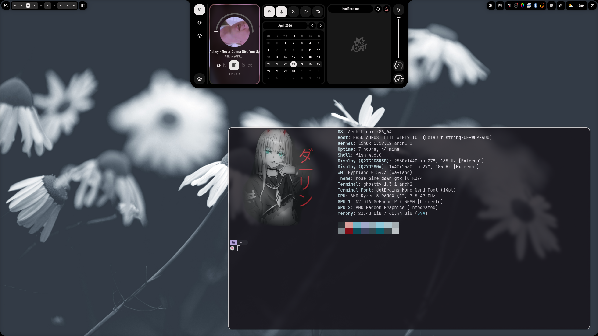

# Dots

My personal set of dotfiles & archinstall configuration

## Installation

Use the arch installer to install one of the configurations in the archinstall folder

The `post-install.sh` file is there to install & configure anything after initial installation

Beware however, these are all configured to work on **my machines**
(> Insert works on my machine meme)

## Screenshots

